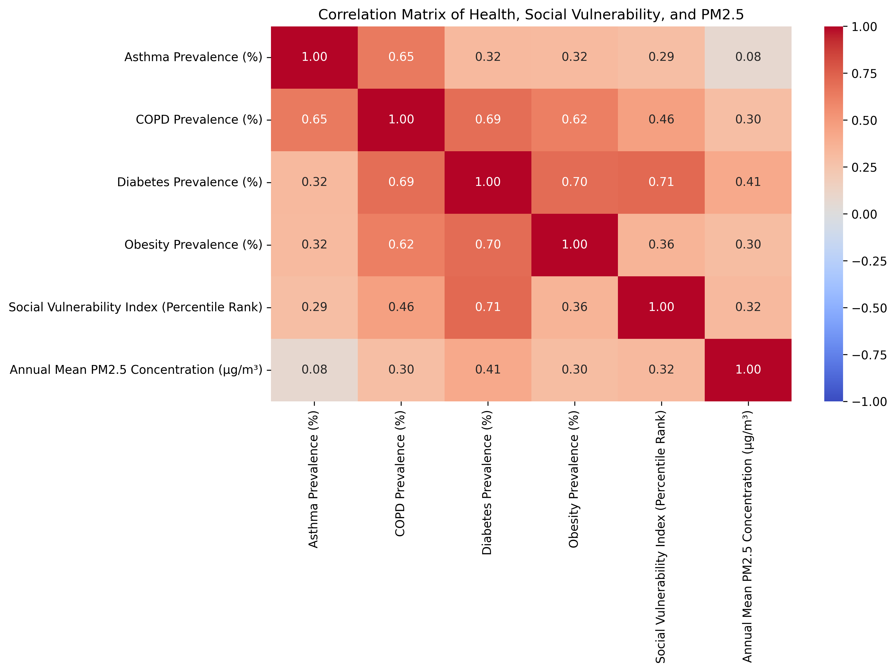
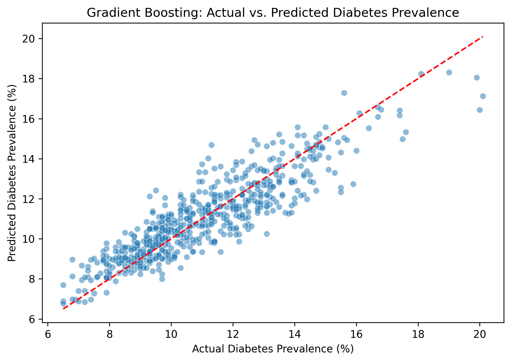
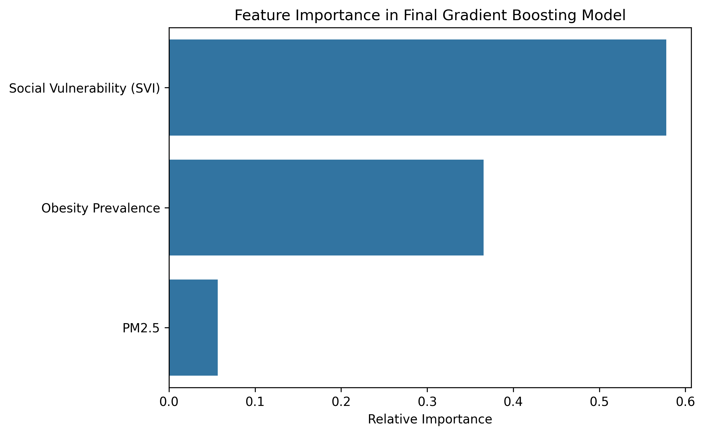

# U.S. County Diabetes Analysis

## Overview

This project examines county level diabetes prevalence across the United States using health, social vulnerability, obesity, and PM2.5 data.

The analysis combines multiple public datasets to explore relationships between social, environmental, and health factors and to predict diabetes prevalence across U.S. counties.

The project includes data cleaning and integration, exploratory data analysis, statistical modeling, regression diagnostics, cross-validation, and machine learning.

---

## Research Question

How are social vulnerability and PM2.5 associated with diabetes prevalence across U.S. counties, and how well can diabetes prevalence be predicted using social, environmental, and health characteristics?

---

## Data Sources

The project combines county-level data from:

- **CDC PLACES** — county-level health prevalence estimates
- **CDC/ATSDR Social Vulnerability Index (SVI)** — social vulnerability measures
- **CDC PM2.5 Data** — daily predicted PM2.5 concentrations retrieved through a public API

Daily PM2.5 observations for 2022 were aggregated to calculate annual mean PM2.5 concentration for each county.

After matching the datasets using County FIPS codes, the final analytical dataset contained **3,051 U.S. counties**.

---

## Variables

The analysis examined:

- Diabetes prevalence
- Obesity prevalence
- Asthma prevalence
- COPD prevalence
- Social Vulnerability Index (SVI)
- Annual mean PM2.5 concentration

Diabetes prevalence was the primary outcome used for statistical and predictive modeling.

---

## Exploratory Data Analysis

Exploratory analysis showed meaningful relationships between health and social characteristics across U.S. counties.

Social vulnerability and obesity showed strong positive relationships with diabetes prevalence, while PM2.5 showed a weaker positive relationship.

### Correlation Matrix

The correlation analysis suggested that counties with higher social vulnerability and obesity prevalence also tended to have higher diabetes
prevalence.
These relationships were investigated further using statistical modeling.

---

## Statistical Analysis

A multiple linear regression model was first developed using:

- Social Vulnerability Index (SVI)
- Annual mean PM2.5

The model explained approximately **54.6% of the variation** in county level diabetes prevalence.

Both SVI and PM2.5 showed statistically significant positive associations with diabetes prevalence.

Regression diagnostics identified heteroscedasticity, so **HC3 robust standard errors** were used for statistical inference. Both predictors remained
statistically significant after the adjustment.

Residual analysis also revealed an important pattern: counties with higher obesity prevalence tended to have larger underprediction errors.

The correlation between obesity prevalence and the initial model residuals was approximately **0.605**.

This finding motivated the addition of obesity to the predictive model.

---

## Predictive Modeling

Two Linear Regression models were initially compared:

| Model | R² | MAE | RMSE |
|---|---:|---:|---:|
| SVI + PM2.5 | 0.559 | 1.204 | 1.524 |
| SVI + PM2.5 + Obesity | **0.757** | **0.885** | **1.132** |

Adding obesity substantially improved predictive performance.

The analysis then compared three machine-learning approaches using **5 fold cross validation**:

| Model | CV R² | CV MAE | CV RMSE |
|---|---:|---:|---:|
| Linear Regression | 0.740 | 0.896 | 1.164 |
| Random Forest | 0.751 | 0.870 | 1.137 |
| **Gradient Boosting** | **0.770** | **0.842** | **1.094** |

Gradient Boosting showed the strongest average crossvalidation performance and was selected as the final model.

---

## Final Model Performance

The final Gradient Boosting model achieved:

- **R²: 0.795**
- **MAE: 0.817**
- **RMSE: 1.040**

The model explained approximately **79.5% of the variation in diabetes prevalence** among the test counties.

On average, predicted diabetes prevalence differed from observed prevalence by approximately **0.82 percentage points**.

### Actual vs. Predicted

Predictions generally followed the perfect prediction line, although some counties with very high diabetes prevalence were still underestimated.

---

## Feature Importance

Feature importance from the final Gradient Boosting model was used to examine which predictors contributed most to prediction.

### Feature Importance

Social vulnerability provided the strongest predictive information, followed by obesity prevalence.

PM2.5 contributed less predictive information when all three variables were considered together.

Feature importance represents predictive contribution within this model and should not be interpreted as causation.

---

## Key Findings

- Social vulnerability showed a strong positive relationship with diabetes prevalence.

- PM2.5 was positively associated with diabetes prevalence, but its predictive contribution was smaller than those of SVI and obesity.

- Residual analysis identified obesity as an important source of information missing from the initial SVI + PM2.5 model.

- Adding obesity increased Linear Regression R² from **0.559 to 0.757**.

- Gradient Boosting produced the strongest cross-validation performance.

- The final model achieved an R² of **0.795** and an MAE of **0.817 percentage points** on the test set.

---

## Limitations

This analysis uses county-level data. Relationships observed across counties should not be interpreted as relationships between individual people.

The models identify statistical associations and predictive relationships, not causal effects.

The final model also includes a limited number of predictors. Other factors such as healthcare access, physical activity, age, income, and food environment may provide additional information about differences in diabetes prevalence.

The overall SVI is a composite measure, so its high predictive importance does not identify which individual dimensions of social vulnerability are most important.

---

## Tools and Technologies

- Python
- Pandas
- NumPy
- Matplotlib
- Seaborn
- Scikit-learn
- Statsmodels
- REST API
- Google Colab
- GitHub

---

## Future Work

Future analysis could:

- Examine individual components of the Social Vulnerability Index
- Include additional health, behavioral, and socioeconomic predictors
- Compare patterns across geographic regions
- Investigate urban and rural differences
- Explore spatial modeling methods

---

## Conclusion

This project demonstrates how health, social, and environmental datasets can be combined to investigate geographic differences in diabetes prevalence.

The analysis progressed from exploratory analysis and statistical modeling to regression diagnostics, residual investigation, and machine learning.

Social vulnerability and obesity provided the strongest predictive information among the variables examined, while PM2.5 showed a smaller contribution in the final model.

The final Gradient Boosting model explained approximately **79.5% of the variation in diabetes prevalence in the test data**, demonstrating the value of combining multiple sources of county-level information for predictive analysis.

---

## Project Notebook

The complete analysis, including data preparation, exploratory analysis, statistical modeling, diagnostics, model comparison, and evaluation, is
available in the Jupyter notebook in this repository.
